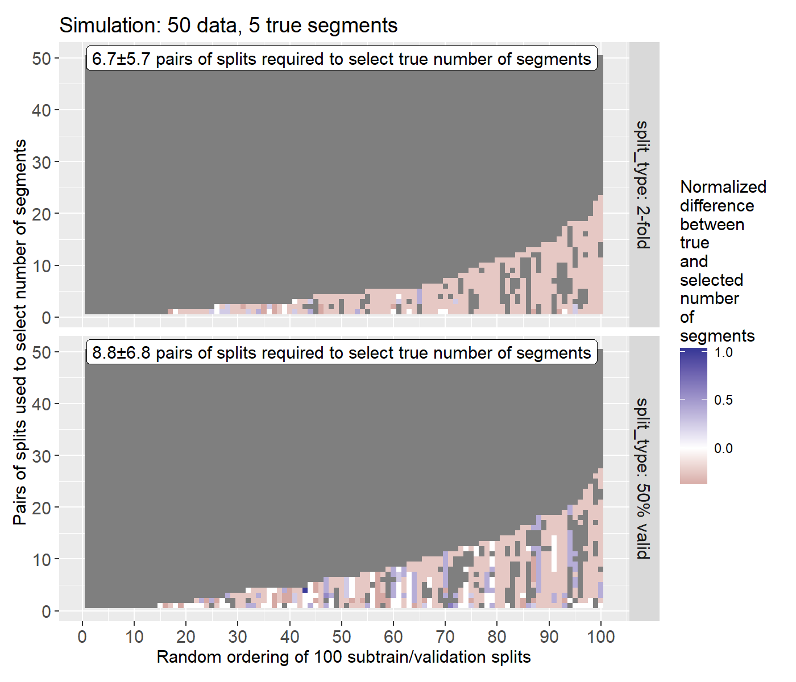

Figures exploring how cross-validation can be used for segmentation model selection.

** 17 Sept 2025

[[file:figure-most-frequently-selected-orderings.R]] makes

Figure above shows how many random subtrain/validation splits are
required to get a consistent selection of the number of segments (5 in
this case).

- 100 subtrain/validation splits were computed, using either
  2-fold CV 50 times, or 50% holdout 100 times.
- For each split we compute the validation error and minimize it to
  get an estimated number of segments for that split.
- In considering several repetitions/splits, we use the number of
  segments which was most frequently the minimizer of the validation error.
- We consider 100 different random orderings of these splits (X axis).
- For each random ordering, we compute the most frequent number of segments, using 1 to 50 pairs of splits (Y axis).
- Each entry in the matrix/heatmap shows the error of the selected number of segments, with respect to the true number of segments (5).
  - If there is no difference (correct selection of 5 segments), the entry is grey.
  - Blue for over-estimation (too many segments), red for under-estimation (too few).
- Random orderings on the X axis are sorted by the last pair which is erroneous.
  - perfect orderings on the left never make mistakes, from 1 to 50 pairs of splits.
  - worst orderings on the right require the most pairs (~25) before selecting the right number of segments.
- On average we need 6--9 pairs of splits, so ~20 subtrain/validation splits, to correctly select the number of segments.
- In fact ~30 subtrain/validation splits are required if you want to be really sure you got the right number of segments.

** 16 Sept 2025

Interactive figures for [[https://tdhock.github.io/gallery-change-point/][change-point gallery]]

- [[file:figure-most-frequently-selected-fr.R]]
- [[file:figure-most-frequently-selected.R]]
- [[file:figure-one-split-duration.R]]
- [[file:figure-one-split.R]]
